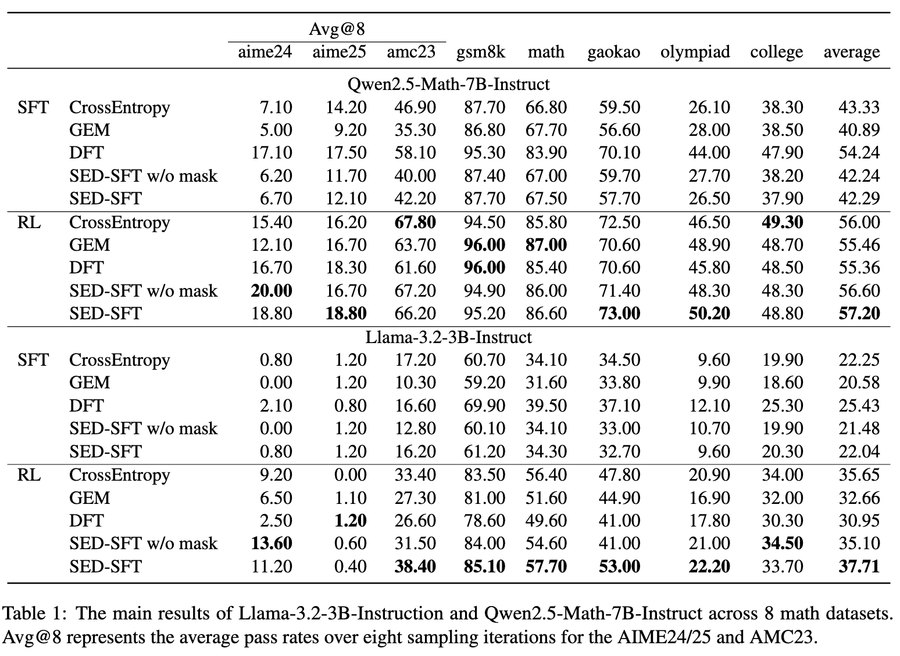

# SED-SFT: Selectively Encouraging Diversity in Supervised Fine-Tuning

## Overview
We propose SED-SFT, which adaptively encourages diversity based on the token exploration space. This framework introduces a selective entropy regularization term with a selective masking mechanism into the optimization objective. Extensive experiments across eight mathematical benchmarks demonstrate that SED-SFT significantly enhances generation diversity with a negligible computational overhead increase compared with CE loss.




## Installation
```bash
pip install -r requirements.txt
```

## Quick Start

### 1. Prepare Data

Download the training dataset:
- [MiroMind-M1-SFT-719K](https://huggingface.co/datasets/miromind-ai/MiroMind-M1-SFT-719K)

Download backbone models:
- [Llama-3.2-3B-Instruct](https://huggingface.co/meta-llama/Llama-3.2-3B-Instruct)
- [Qwen2.5-Math-7B-Instruct](https://huggingface.co/Qwen/Qwen2.5-Math-7B-Instruct)

### 2. Preprocess Data

Tokenize the dataset for training:

```bash
# Set your paths first, then run:
bash train_scripts/tokenize_data.sh
```

### 3. Train the Model

Run SFT training with SED loss:

```bash
bash train_scripts/train_cumsum_numina.sh
```

## Project Structure

```
.
├── train.py                    # Main training script
├── sft_trainer_v2.py           # Custom SFT trainer with multiple loss functions
├── preprocess_data.py          # Data preprocessing and tokenization
├── requirements.txt            # Python dependencies
├── data/                    
│   ├── math_train_data_filtered_qwen25_revised.parquet # rl training data
├── configs/                    # DeepSpeed configurations
│   ├── zero2.json
│   └── zero3.json
├── train_scripts/              # Training shell scripts
│   ├── tokenize_data.sh
│   ├── grpo_math-cumsum.sh
│   └── train_cumsum_numina.sh
└── utils/                      # Triton-optimized loss implementations
    ├── __init__.py
    ├── ce_triton_loss.py       # Cross-entropy loss
    ├── gem_triton_loss.py      # GEM loss
    ├── sed_triton_loss.py      # SED loss
    ├── gem_triton_ops.py       # GEM Triton kernels
    └── sed_triton_ops.py       # SED Triton kernels
```

## Acknowledgments

This implementation is based on:
- [GEM](https://github.com/liziniu/GEM)
- [Flash-Attention](https://github.com/Dao-AILab/flash-attention)

## Citation

If you find this work useful, please cite:

```bibtex
@misc{chen2026sedsftselectivelyencouragingdiversity,
      title={SED-SFT: Selectively Encouraging Diversity in Supervised Fine-Tuning}, 
      author={Yijie Chen and Yijin Liu and Fandong Meng},
      year={2026},
      eprint={2602.07464},
      archivePrefix={arXiv},
      primaryClass={cs.CL},
      url={https://arxiv.org/abs/2602.07464}, 
}
```

